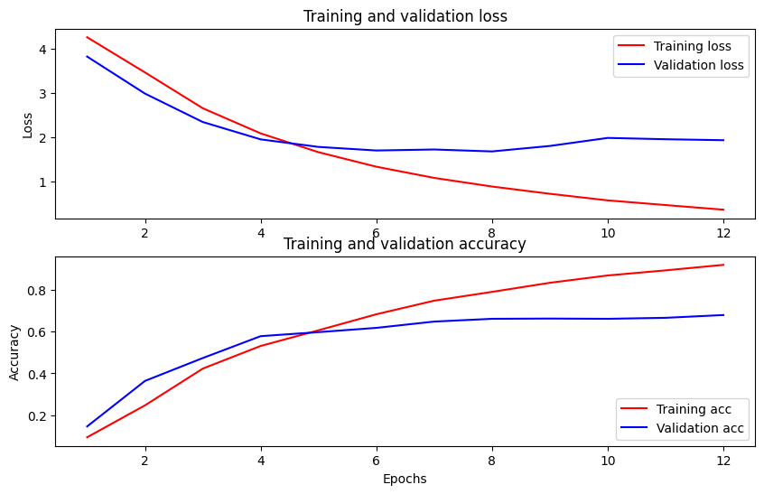

# KPMG-NLP

## Scope:
This junior educational project is developed for KPMG, an International Limited is a multinational professional services network, and one of the Big Four accounting organizations. 
This is a Natural language processing (NLP) project, aiming to extract relevant information, present it in structured way to the client by incorporating the extracted information into available platforms.

## Project Description:

**Preprocessing**

First we preprocess the files by doing different checks, because of a vertical or horizontal division by language of the documents. Then we feed the documents to Google DocumentAI, which produces a result as a dataframe and .txt files, split according to their language. 

The resulting files are then checked with language detection and if necessary, split. And then moved to the /processed_data folder

On this data we tried to apply a model (RobBERT) to classify documents. 

For demo we run a telegram bot for notification on Telegram

**Application**

A webserver will run with an input form. There we will give a file that is supposedly extracted from a RSS feed or similar method.

**Processing** 

A file input on the webserver is feeded to the process.py file which will run modified functions from preprocessing sequentially.

For language detection we use FastTEXT 
For the model we use https://github.com/iPieter/RobBERT (A Dutch RoBERTa-based language model)
For the summarization we use MBartForConditionalGeneration
For topic detection we use Rake_NLTK

# Prerequisites

  - CLA_meta_from_2018.csv as provided by KPMG
  - CLA documents as published, in .pdf format

# Includes
### Preprocessing (for all documents)

1. For handling the files:
- fix_languages			 : Checks the languages of all extracted text files and switches the NL and FR version when needed.

- move_unprocessed_files : Moves files that have not been processed yet.

- process_docs_cloud		 : Processes files with Google DocumentAI.

- split_files				 : Detects if files needed to be split vertically by calculating mean and average length number and max length of sentences in the file.

- split_max_page_10		 : Splits .pdf documents with more than 10 pages for the Google Document AI (max page limit=10).

2. For making targets for the model:
- (Deprecated) classification-meta_cla: Makes classification of documents based on highest ranked words in the metadata title descriptions (with NLTK and Rake-NLTK)

- (Deprecated) make_target            : Makes the targets for our model.  
      -This can be a list of most important keywords, extracted with NLP (creates a dbase with the highest ranked keywords per document with Rake-NLTK). 
      -It can also be a list of the title for each document, extracted from the metadata .csv 
                          The output will be written to a /csv folder

- make_targets_from_metadata.ipynb: New file to make better targets with Rake-NLTK (**use this instead of classification-meta_cla**)

3. For checking the output of text processing:
- visual_inspection		 : File for quick  visual inspection of the extracted text files.

### Analysis
  - concat_NL_doc : file to plot graphs

### Model 
  **Deprecated**
  - Model :  Makes a model for classification of documents. Works with BERT and a Dutch RobBERTa tensorflow pretrained model. 
 **Now use**
  - model_h_robberta_clusters : To make the targets from 100 clusters
  - model_h_robberta_clusters_RUN : To Run the model on a .csv file with condensed text and cluster targets
  
### Processing (for demo app)
 - split_text_horizontally : Function to process a .pdf file that has not been split with DocumentAI. Detects the languages per paragraph and writes output to NL and FR .txt files
 - split_pdf_vertically    : Function to detect if an input .pdfs has to be split. Detection method as explained above
 - split_max_10_pages      : Function to detect if an input .pdfs has to be split into pages for DocumentAI (max page limit=10).  
 - process_cloud           : Function to process a .pdf file with Google DocumentAI. Outputs as txt files
 - get_abstr_summary       : Function to produce and abstract summary from a input text. Uses summi
 - combine_txt_files       : Function to combine text file that were obtained after the split_max_10_pages
 
 ###App
 
 - server                  : The Flask server to run for hosting a webpage for the demo
 - templates               : Templates for the webserver
 
# Requirements
  
  - Python 3.7.9
  - CUDA and CuNN 
  - Google Cloud account 

# Installation

 - Create and activate a virtual env
 - Install the necessary libraries from the requirements.txt file in the main folder 
`
# Usage 

create a telegram webhook with CMD:
`ngrok http 80`
 
Get the forwarding URL from the ngrok dashboard

`run ./app/server.py`

open http://127.0.0.1/input

# Method

- Preprocessing is done in sequential order and with Google DocumentAI (synchronous)
- Model is based on clusters
- The text from the preprocessing output is processed with NLTK_Rake with DEGREE_TO_RATIO method to extract the most important phrases and keywords
- From these condensed text we make 100 clusters with KMeans
- We train the model based on a dataset of the processed texts with these 100 clusters
   
  - Model = robbert-v2-dutch-based
  - Optimizer= AdamW
  - Tokenizer= RobertaTokenizer
  - Loss = CategoricalCrossentropy

# Results

- The preprocessing works great and we were able to preprocess ALL documents.
- Google DocumentAI OCR reading works great on .pdf files with a single language, so we feed single language docs or check each paragraph with FastText language detection
- Classification model is based on a Dutch based Robberta model from KU_Leuven and targets 100 different clusters.

  - We claim a classification accuracy of about 67% on the validation set (15% of the data)
  - This figure shows the results with model trained on processed text with max length of 368 in 12 epochs, 4 batches, with CategoricalCrossentropy and AdamW optimizer

  

  - Training results are stored in /model/output
  - Model is saved in /model
  - 
-For the client app we made a simple tool to produce results with telegram. The results of processing a file will be output to a Telegram bot channel.
 
# Improvements
There is room for many improvements
- Language detection can perform better when feeding through DocumentAI OCR and then checking paragraphs for all documents, also the vertically split files
- We need to find a way to remove 'Erratum' blocks
- Perhaps LDA can help us to define the topic of a document better
- Fine tuning the extrated text processing method might improve model results

## Contributors
- [Sedat Mehmed](https://github.com/sedat01)
- [Frank Trioen](https://github.com/Francode77)
- [shakeel Ahmad](https://github.com/shakilkhan8219)

## Acknowledgements

 - [BeCode](https://becode.org/) coaches (Louis & Chrysanthi)
 - [KPMG](https://home.kpmg/xx/en/home.html)
